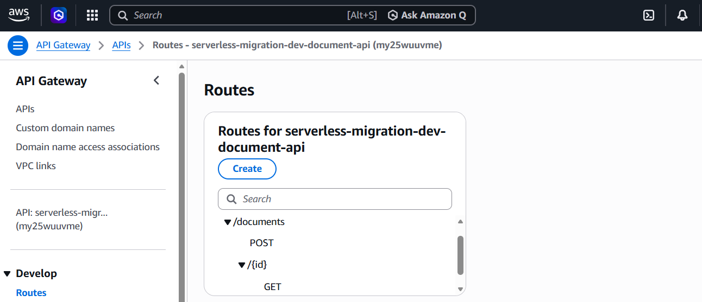
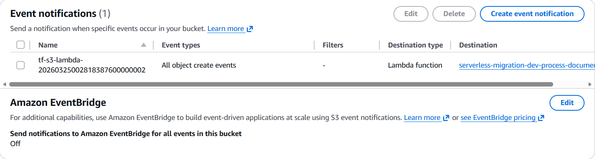
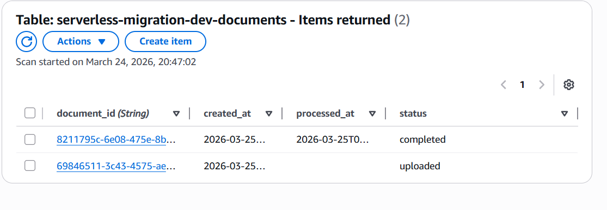
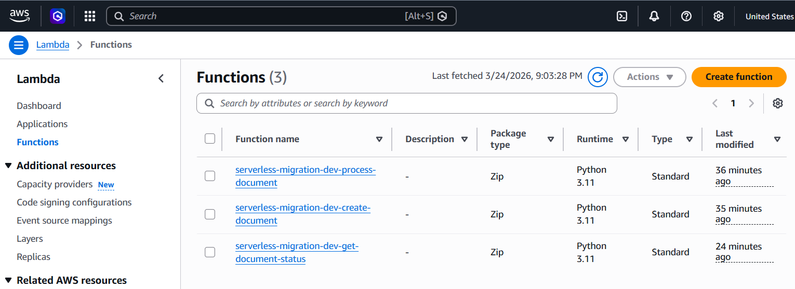
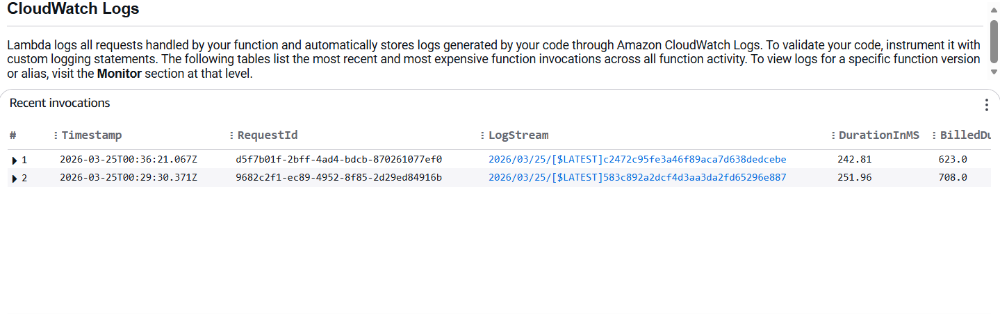

# Serverless Document Processing System on AWS

I rebuilt a simple file upload application using a fully serverless architecture on AWS, focusing on scalability, cost-efficiency, and event-driven design.

## 🚀 Architecture Overview

This system replaces traditional backend file handling with a direct-to-S3 upload pattern using presigned URLs.

### Flow:
1. Client calls API to create a document
2. API (Lambda) generates a document ID and presigned S3 upload URL
3. Client uploads file directly to S3
4. S3 triggers processing Lambda
5. DynamoDB updates document status
6. Client retrieves status via API

## 🧱 AWS Services Used

- API Gateway (HTTP API)
- AWS Lambda (3 functions)
- Amazon DynamoDB
- Amazon S3 (event-driven)
- Amazon SNS (notifications)
- IAM (least privilege access)

## 🔥 Key Feature

### Presigned URL Upload
Instead of routing files through the backend:

Client → API → S3

This reduces backend load, improves scalability, and aligns with real-world cloud architecture patterns.

## 📸 Screenshots

### 1. API Gateway Routes
Shows the application entry points:
- `POST /documents`
- `GET /documents/{id}`



---

### 2. S3 Event Trigger
Uploads bucket configured to trigger processing Lambda on object creation.



---

### 3. DynamoDB Status (Completed)
Document successfully processed and status updated to `completed`.



---

### 4. Lambda Functions
Separation of responsibilities across:
- create document
- process upload
- get status



---

### 5. Lambda Execution Logs
Proof of real-time processing triggered by S3 event.


## 🧠 What I Learned

- Designing event-driven architectures
- Using presigned URLs for direct S3 uploads
- Structuring serverless applications
- Thinking like a Solutions Architect instead of just implementing features

## ⚙️ Deployment

```bash
terraform init
terraform plan
terraform apply
